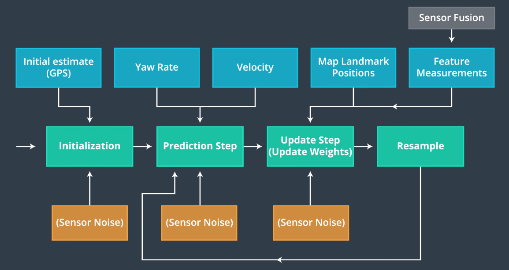
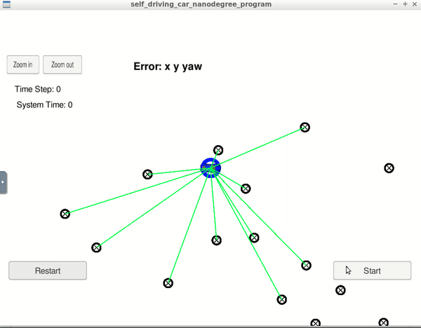
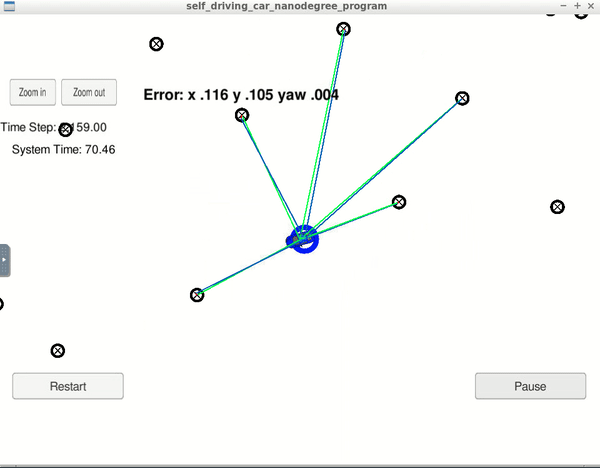

# Kidnapped Vehicle

## Project Introduction and Objective
Our vehicle has been kidnapped and transported to a new location! Luckily it has a map of this location, a (noisy) GPS estimate of its initial location, and lots of (noisy) sensor and control data.

In this project I have implemented a 2 dimensional particle filter in C++. My particle filter will be given a map and some initial localization information (analogous to what a GPS would provide). At each time step my filter will also get observation and control data.

## Particle Filter

Monte Carlo Localization (MCL) also referred to as Particle Filter Localization. It uses a collection of particles to represent discrete guesses where the robot might be.

The essence of a Particle Filter is to have these particles guess where the robot might be moving, but also have them survive using effectively survival of the fittest so that particles that are more consistent with the measurements are more likely to survive and as a result places of high probability will collect more particles, and therefore be more representative of the robot's posterior belief.

## Running the Code
This project involves the Term 2 Simulator which can be downloaded [here](https://github.com/udacity/self-driving-car-sim/releases)

This repository includes two files that can be used to set up and install uWebSocketIO for either Linux or Mac systems. For windows you can use either Docker, VMware, or even Windows 10 Bash on Ubuntu to install uWebSocketIO.

Once the install for uWebSocketIO is complete, the main program can be built and ran by doing the following from the project top directory.

1. mkdir build
2. cd build
3. cmake ..
4. make
5. ./particle_filter

Alternatively some scripts have been included to streamline this process, these can be leveraged by executing the following in the top directory of the project:

1. ./clean.sh
2. ./build.sh
3. ./run.sh

Tips for setting up your environment can be found [here](https://classroom.udacity.com/nanodegrees/nd013/parts/40f38239-66b6-46ec-ae68-03afd8a601c8/modules/0949fca6-b379-42af-a919-ee50aa304e6a/lessons/f758c44c-5e40-4e01-93b5-1a82aa4e044f/concepts/23d376c7-0195-4276-bdf0-e02f1f3c665d)

INPUT: values provided by the simulator to the c++ program

// sense noisy position data from the simulator

["sense_x"]

["sense_y"]

["sense_theta"]

// get the previous velocity and yaw rate to predict the particle's transitioned state

["previous_velocity"]

["previous_yawrate"]

// receive noisy observation data from the simulator, in a respective list of x/y values

["sense_observations_x"]

["sense_observations_y"]


OUTPUT: values provided by the c++ program to the simulator

// best particle values used for calculating the error evaluation

["best_particle_x"]

["best_particle_y"]

["best_particle_theta"]

Modify the code until you get a message as followed in the simulator :
```
Success! Your particle filter passed!
```

# Implementing the Particle Filter
The directory structure of this repository is as follows:

```
root
|   build.sh
|   clean.sh
|   CMakeLists.txt
|   README.md
|   run.sh
|
|___data
|   |   
|   |   map_data.txt
|   
|   
|___src
    |   helper_functions.h
    |   main.cpp
    |   map.h
    |   particle_filter.cpp
    |   particle_filter.h
```


## Inputs to the Particle Filter
You can find the inputs to the particle filter in the `data` directory.

#### The Map*
`map_data.txt` includes the position of landmarks (in meters) on an arbitrary Cartesian coordinate system. Each row has three columns
1. x position
2. y position
3. landmark id

## Localization Pipeline

1. Initialization with the best estimates, such as GPS measurement
2. For each particle, predict its states based on motion model, suck as bicycle model, by adding control inputs.
3. For each particle, update its weight using map landmark positions and feature measurement, coordinate transformation need to be performed at this step.
4. Resampling by drawing particles proportional to its weight.
5. This new set of particles represent a refined estimate of the vehicle position.

## System Overview



## Demo Run

A run screen is snown below:



* Blue car - ground truth data.
* Blue circle, with arrow to the heading of the car - estimated location.
* Green lines - Laser range reading from the car.
* Blue lines - Laser range reading from the particle filter.

Notice that the green laser sensors from the car nearly overlap the blue laser sensors from the particle, this means that the particle transition calculations were done correctly.

As shown in the above recording, the localizer successfully localized the moving car in the feature map.

* The RMSE for x, y positions is reaching 0.116; while the RMSE for yaw is able to reach 0.004
* The LIDAR is running at 10Hz for this project. The pipeline took less than 73 seconds to process 2443 readings (244 seconds worth of data)

## Result

Evaluation of the particle filter is done by using the weighted mean error function using the ground truth position of the car and the weights of the particles as inputs, at each time step.

In the Video below, the blue circle is the best particle that we have, which are the lasers from the best particle to the landmarks and the green lines are lasers from the car to the landmarks. As they are pretty much overlaped, that means particle filter is working well in localizing the car.

